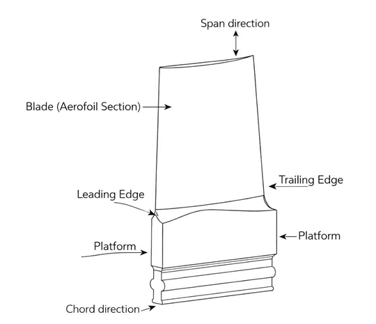
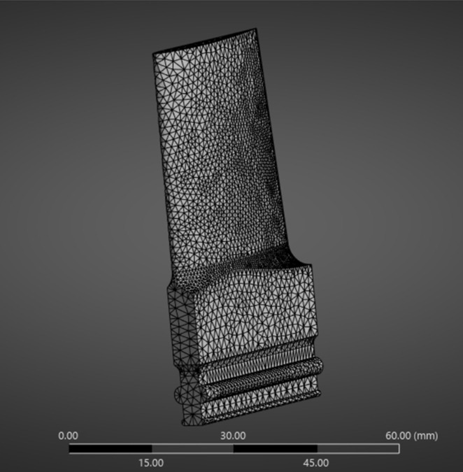
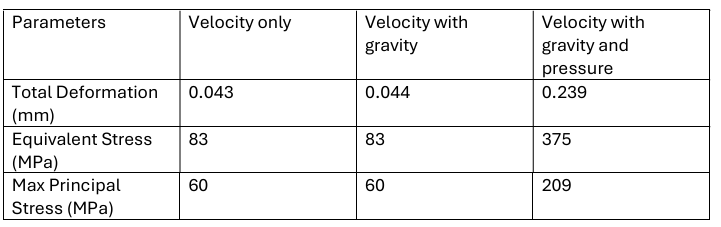
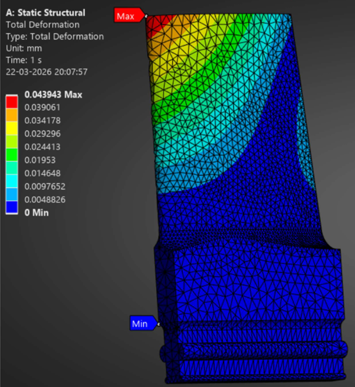
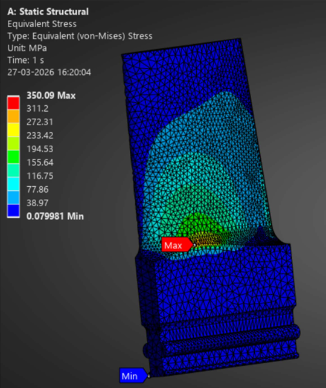
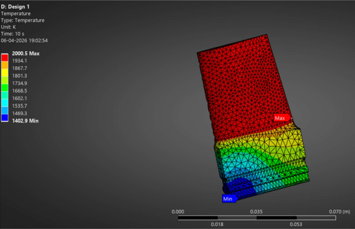
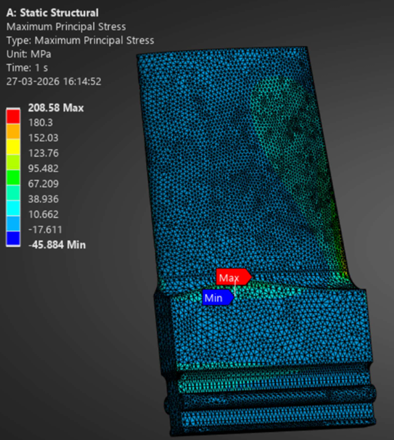
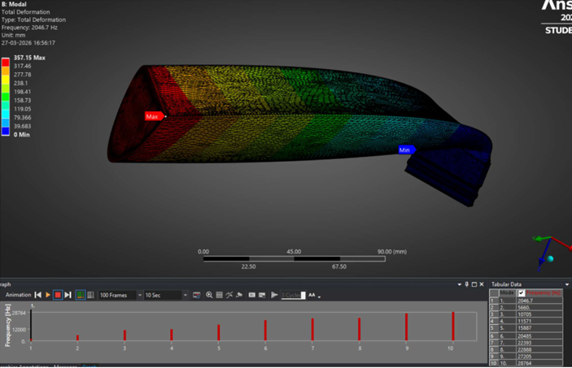
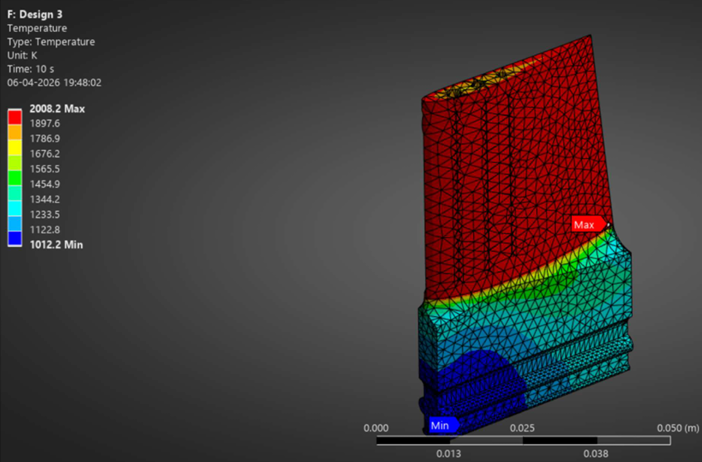

<h1 align="center">Gas Turbine Blade Structural & Thermal Analysis</h1>

Finite Element Analysis (FEA) investigation of gas turbine blade structural and thermal behaviour using ANSYS Workbench

Structural Analysis • Thermal Simulation • Modal Analysis • Aerospace Engineering

---

## Overview

This project focuses on the structural and thermal investigation of a gas turbine blade using ANSYS Workbench.

The objective was to evaluate blade performance under aerodynamic, thermal, and mechanical loading conditions commonly experienced in aerospace propulsion systems.

The investigation focuses on:
- structural deformation
- equivalent stress distribution
- thermal behaviour
- fatigue performance
- modal frequency analysis
- engineering reliability validation

---

## Technical Details

### Software Used
- ANSYS Workbench
- ANSYS Mechanical
- SolidWorks
- MATLAB

### Engineering Methodology
- Finite Element Analysis (FEA)
- Static structural simulation
- Thermal analysis
- Fatigue life estimation
- Modal frequency investigation
- Mesh quality validation

### Key Engineering Areas
- Gas Turbine Engineering
- Aerospace Propulsion
- Structural Mechanics
- Thermal Engineering
- Fatigue & Failure Analysis
- Mechanical Design Validation

---

# Simulation Workflow & Results

---

## 1. Blade Geometry

  

<em>Gas turbine blade geometry showing aerofoil profile, platform section, leading edge, and trailing edge configuration.</em>

---

## 2. Mesh Generation

  

<em>Finite element mesh generated for structural and thermal simulations using ANSYS Workbench.</em>

---

## 3. Comparative Engineering Results

  

<em>Comparison of deformation and stress values under different loading conditions.</em>

---

## 4. Structural Deformation Analysis

  

<em>Total deformation contour showing blade displacement under operational loading conditions.</em>

---

## 5. Equivalent Stress Analysis

  

<em>Von-Mises equivalent stress distribution used for structural integrity assessment.</em>

---

## 6. Temperature Field Investigation

  

<em>Temperature field simulation demonstrating thermal loading behaviour during turbine operation.</em>

---

## 7. Maximum Principal Stress

  

<em>Maximum principal stress contour identifying critical stress concentration regions.</em>

---

## 8. Modal Analysis

  

<em>Modal frequency analysis performed to investigate vibration behaviour and resonance characteristics.</em>

---

## 9. Thermal Distribution Analysis

  

<em>Thermal contour illustrating temperature distribution across turbine blade surfaces.</em>

---

# Results & Findings

The investigation demonstrated the effectiveness of FEA methodologies for evaluating turbine blade structural reliability and thermal performance.

Key findings include:

- improved understanding of blade stress behaviour
- identification of thermal concentration regions
- fatigue performance evaluation under cyclic loading
- validation of mesh and simulation quality
- enhanced structural reliability assessment
- vibration characteristic investigation through modal analysis

The project demonstrates the importance of simulation-driven engineering approaches in aerospace propulsion system development.

---

# Future Improvements

Potential future developments include:

- CFD coupled thermal analysis
- transient thermal simulations
- material optimisation studies
- AI-assisted engineering optimisation
- advanced creep analysis
- high-temperature material investigation

---

# Author

Varun Saini  
Aerospace Engineering Graduate  
Preston, United Kingdom
